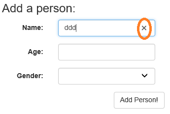

# Supporting Internet Explorer

## Angular IE Support

 * Angular 2.0: IE 9+
 * Angular 1.3: IE 9+
 * Angular 1.2: IE 8+

As of late 2015, "old IE" usage (IE <= 8) sits at less than 3%.

## Chapter Assumptions

 * You need to support IE 8
 * You are using Angular 1.2

## Angular IE Support

 * The Angular team will only make fixes for bugs on IE9 and above.
 * The Angular team does not test against IE8 and under.
 * Your app still *might* work on older versions of IE.
 * Developers are ultimately responsible for determining interoperability

## Conditional Comments

* This module uses "conditional comments"
* Conditional comments are a proprietary feature of IE
* Many IE workarounds will use conditional comments as we will soon see.

```html
  <!--[if lte IE 8]
    Insert code for IE 8 users...
  <![endif]-->
```

## Pitfall: Interpolation in Styles

Affects IE < 11

Avoid this:

```html
  <h1 style="{{ myStyle }}"> Avoid </h1>
```

Instead, use `ng-style`:

```html
  <h1 ng-style="myStyle"> Recommended  </h1>
```

Note: Angular also provides `ng-href` and `ng-src` as well.

## Pitfall: Interpolation in Form "type"

Internet Explorer overwrites `type` attributes to `type="submit"` before Angular has a chance to run interpolation.

```html
AVOID:
<input type="{{ myVar }}" />

```

```html
SOLUTION:
<input ng-attr-type="myVar" />

```


## Pitfall: Non-standard HTML Tags

 * IE 8 can't deal with non-standard tags like `<ng-view />`
 * There are two options for dealing with this (see next).

## Option 1: Use Attribute Directives

```html
<ng-view> Avoid </ng-view>
```

```html
<div ng-view> Recommended </div>
```

"E" Directives can't always be avoided.
This is less than ideal.
What's the alternative?

## Option 2: Angular UI IE Shiv

```html
<!--[if lte IE 8]>
<script type="text/javascript">
  // IE Shiv looks for "myCustomTags" global
  window.myCustomTags = ['userForm', 'profilePanel'];
</script>
<script src="lib/angular-ui-ieshiv.js"></script>
<![endif]-->
```

IE Shiv helps deal with IE 8's inability to parse custom tags.

## Option 3: The Manual Approach

Another approach is to manually add custom tags to the document HEAD. This

```javascript
  <head>
  <!--[if lte IE 8]
    <script>
      document.createElement('my-directive-tag');
    </script>
  <![endif]-->
```

Calling `createElement` on custom tags lets IE know that they exist.

## JSON polyfill in IE < 8

 * AngularJS uses JSON
 * IE 7 and lower don't support it by default
 * Consider adding JSON 3 or JSON 2 libraries

```html
<script
  src="http://cdnjs.cloudflare.com/ajax/libs/json3/3.3.2/json3.js">
</script>
```

## AJAX Caching

IE is the only browser that caches AJAX requests.
You can get around this by adding a `Cache-Control: no-cache` header to `$http`.

```javascript
myApp.config(function($httpProvider) {
  $httpProvider
    .defaults
    .headers
    .common['Cache-Control'] = 'no-cache';
});
```

## Problem: ng-repeat and HTML5 elements

Using HTML5 elements in an `ng-repeat` will prefix the element with a '`:`' character.

This *only* happens with "real" IE8, not compatibility mode.

Example: `<article ng-repeat="item in items">` generates `<:article>`

This will defeat any CSS styling for the tag.

Let's take a look at a workaround (next slide).

## Solution: Add Special CSS Rules

```css

 /* Normal AND escaped version */
section, \:section {
  /* Styling here... */
}

```

Depending on the project, it may be best to avoid HTML5 semantic elements (such as `<main>`) as they can create unexpected behavior in legacy browsers.

## Problem: .catch()ing Promises

 * IE 8 does not allow the use of reserved words as method calls
 * Calling `.catch()` on a promise will raise a syntax error
 * How can we handle rejected promises?

## Solution: .catch()ing Promises

Use `["bracket_notation"]` to work around this flaw.

```javascript

promise.then(function(response) {
  // success
})
["catch"](function(response) {
  // error
});

```

## Problem: IE 11 Form Helpers

IE 11 offers additional form controls to help users clear out form controls.

These buttons do not emit "change" events and as such, can prevent Angular from performing form validation.



## Solution: Hide IE 11 Form Control UI

```css
::-ms-clear { display: none; }
```

Hiding IE specific form controls prevents a user from accidentally circumventing form validation.

## Questions?
