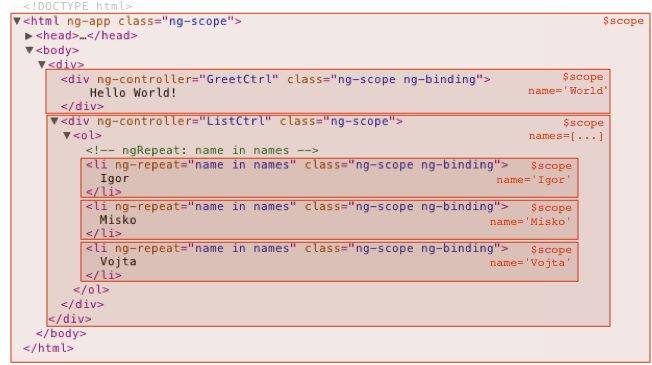
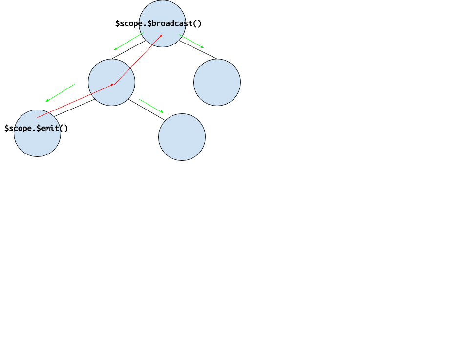

# Scopes and the Digest Cycle

 * Syncing data and UI is essential in Angular.
 * Angular maintains sync using a "Digest Cycle".
 * Scopes act as "view models" seen in other MVC architectures.

## Overview

Internally, Angular performs numerous internal functions to ensure that an application's model layer is always in sync with its view layer.

It maintains sync using "scope objects" and a "digest cycle".

This section will cover scopes and each piece of the "digest cycle" individually.

## What Scopes Provide

 * A scope is a "View Model".
 * Directly tying data to the UI does not scale and is hard to maintain.
 * Scopes act as a glue between data and the UI.
 * Allows sharing of data in multiple UI locations.

Let's take a look at how they work.

## How Scopes Work

 * The "Scope Hierarchy" is a tree like structure of parent / child / sibling scopes.
 * It's much faster to traverse a JS object tree than a DOM tree.
 * The `ng-app` directive creates a single `$rootScope`
 * Every scope (including `$rootScope`) can have child nodes.
 * Scopes can be linked by two means:
   * Prototypal inheritance
   * Internal properties like `$parent`, `$$childHead` and `$$childTail`.

## Scope and DOM Similarities

Scope diagram, courtesy [Angular docs](https://docs.angularjs.org/guide/scope). [CC-BY 3.0](http://creativecommons.org/licenses/by/3.0/)



 Data stays in sync with the UI because of Scopes. 

## Birth of a $scope

Below is an example of how `ng-controller` and `ng-repeat` create child scopes:

```javascript
var parent = $scope;
var child1 = $scope.$new();
var child2 = $scope.$new();
(child1.$parent === parent)      // true
(child1.$$nextSibling == child2) // true
```

Angular keeps track of scope relations via prototypal inheritance and instance properties such as `$parent` and `$$nextSibling`.

## Scope Inheritance?

As stated, scopes reference their parent via prototypal inheritance. They also *reference parent via attributes such as `$parent`*

```javascript
$scope.example = "Defined on parent. Accessible from child.";
var childScope = $scope.$new();
childScope.example // Climb the chain to find `.example` on parent
// => "Defined on parent. Accessible from child."

```

## Problems with Scopes

 * There are times when Angular looses the ability to keep UI and data in sync
 * Let's explore these edge cases.

## DEMO: Intentionally Breaking a $scope

Start at `/IntroAngular/Demos/standard-controller.html`

 1. Grab a scope reference using `angular.element($0).scope()` (circumventing Angular)
 2. Attempt to modify the scope directly.
 3. Did the UI update? Why?

Before explaining what happened, let's take a moment to learn how Angular expressions are evaluated.


## $scope.$eval


Evaluates an "Angular Expression" against the `$scope`.

Same behavior as expressions in templates:

```javascript
$scope.letters = ["a", "b", "c"];
$scope.$eval("letters | limitTo:2 "); // Valid!
// => ["a", "b"]

```

As you may recall, Angular templates always resolve against the current scope.

## $scope.$watch

```javascript
$scope.$watch(
  "userName",
  function(newVal, oldVal){
    console.log("Scope change!");
});

```
Creates a "watch" object that reacts to changes.


Watch Expression is a `string` (`$eval`ed against the $scope) or `function(){}`.

Listener Function is fired *when watch expression output changes*.

## $scope.watchCollection()

Same as `$watch()`, but for collections.

```javascript
$scope.names = ["Rick", "Sarah", "Joe"];
$scope.$watchCollection(
  "names",
  function(newArry, oldArry) {
  // . . .
  // Fired when a member of the collection changes.
});
```

## $scope.$digest()

```javascript
  $scope.myVar = "Notify Angular of Data Changes";
  $scope.$digest();
```
 1. Performs depth first traversal on `$scope` and children.
 2. Processes all `$watch` expressions on each `scope`.
 3. Compares current `$watch` output to previous result
 4. Fires listener functions if old and new values differ.
 3. The process continues until listeners stop firing ("digest stabilization").

 Without this, Angular has no way of knowing it needs to update the DOM or App state. 

## $scope.$apply()

```javascript
// USAGE:
$scope.$apply(function() { return "$scope changing behavior here."; });

// PSEUDOCODE

$apply(expr) {
  try {
    return $eval(expr);
  } catch (e) {
    $exceptionHandler(e);
  } finally {
    $rootScope.$digest();
  }
}

```

Source: Angular Official Documentation, [CC-BY-4.0](http://creativecommons.org/licenses/by/4.0/)

## Pitfall: Not Calling Digest

Changing `$scope` data, but not calling `$digest()`, usually from a non-angular plugin.

```javascript
/* AVOID */
$scope.count = 1;
$("#button").on("click", function(){
  $scope.count++
});

```

Consider using `ng-click`, which calls `$digest()` internally.

## Pitfall: Unstable $watch()

```javascript
$scope.val = 1
// This watch is non-idempotent and therefore
// the digest loop never stabilizes.
$scope.$watch(
  function(){ return $scope.val },
  function(){ $scope.val++ })

```

Infinite loops will raise an exception. Ensure all calls to `$digest` and `$apply` stabilize within 10 digest cycles.

Raising Angular's "TTL limit" is possible, but is a sign of architectural problems.

## "Controller As" Syntax

"Controller As" syntax involves a combination of concepts:

 * Scope Objects
 * Controller Functions
 * Controller Objects.

## Example

Code:
```javascript
app.controller("myCtrl", function($scope){
  this.greeting = "World";
});
```
HTML:
```html
<div ng-controller="myCtrl as vm">
  Hello, {{ vm.greeting }}!
</div>
```
Output:
<pre>
  Hello, world!
<pre>

## Differences with "Controller As"

 * You still have a `$scope` object available, even if you don't use it.
 * Controller objects don't have a prototypal hierarchy.
 * Controller As is the recommended default moving towards Angular 2.0

Unlike a $scope, a controller is just a vanilla JS object.

## A Mental Model of "Controller As"

```javascript
// PSEUDOCODE:
  function Controller($scope) {
    $scope.description = "This is the scope";
    this.description   = "This is the controller";
  }
  myScope = $rootScope.$new();

  // <div ng-controller="Controller as ctrl">

  controller = new Controller(myScope);

  myScope.ctrl = controller;
```

## Exercise

Scopes/Exercises/scope-controller-as.html

## Scopes Events

The next portion will cover $scope events.

## Scope Events: Real Example

Before learning how scope events work, let's see what scope events enable us to do.

[Demo here](http://localhost:8000/Scopes/Solutions/broadcast-emit.html)

## Reacting to $scope Events

 * Scopes, like DOM nodes can emit events.
 * You can register an event handler using `$scope.$on`
 * Some events are internal to angular (such as `$destroy`)
 * Other events can be broadcast and emitted by Angular developers (more later).

```javascript
$scope.$on("$destroy", function(event, payload) {
  console.log("The scope received a destroy event!");
})
```

## The "Event" Object

```javascript
$scope.$on("event_name", function(event_object, arg1, arg2...) { });

```
Event contains useful meta data such as:

 * `event.name`: A reference to the event's name.
 * `event.targetScope`: Where the event originated from (the sender).

## Sending Events

 * `$scope.$emit("name", arg1, arg2...)`: Send an event up, towards parent.
 * `$scope.$broadcast("name", arg1, arg2...)`: Send event down, towards all children.



## Exercise

Scopes/Exercises/broadcast-emit.html

## Questions?

With this information, we're ready to learn about scopes.
